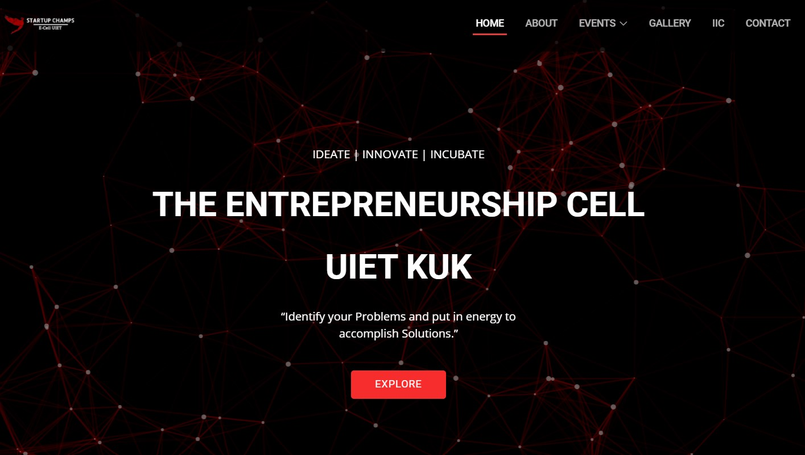

  <h1 align="center">THE ENTREPRENEURSHIP CELL</h1>
  <h2 align="center">UIET KUK</h2>

A Web Application for E-cell UIET made using various tech stacks.

## Technologies Used:
1. HTML
2. CSS
3. JavaScript
4. Bootstrap

## Demo:
Have a look on the website being deployed on firebase.com <a href="https://ecelluietkuk.web.app/">E-cell UIET</a>
## Contributing:

Please Fork this project and send us a pull request.

## Authors:
<a href="https://simrandhiman.me/">Simran Dhiman</a>

#### If you like this project hit ⭐

Thanks for reading 🙏🏽

